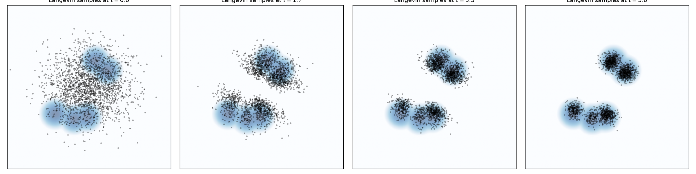
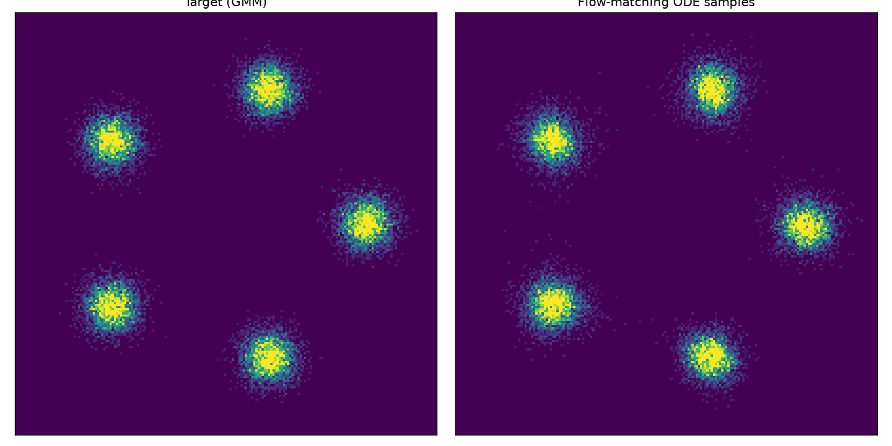
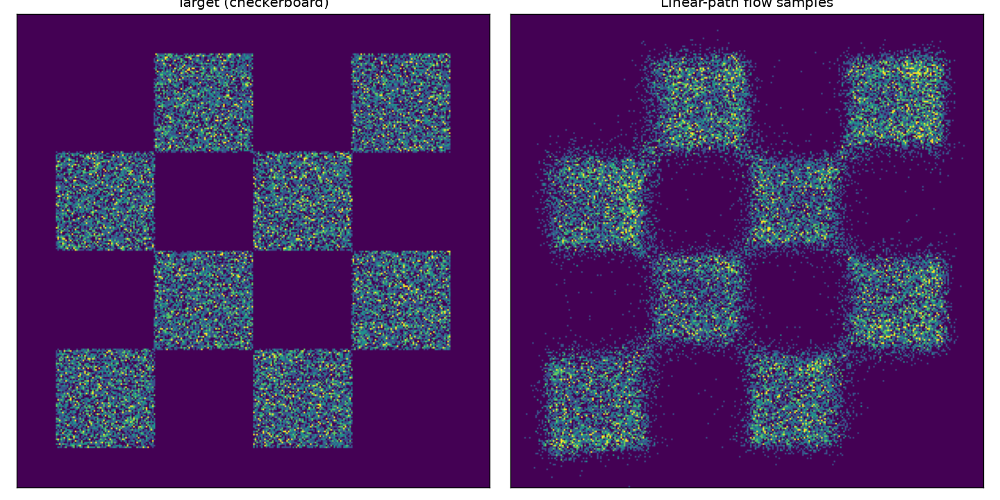
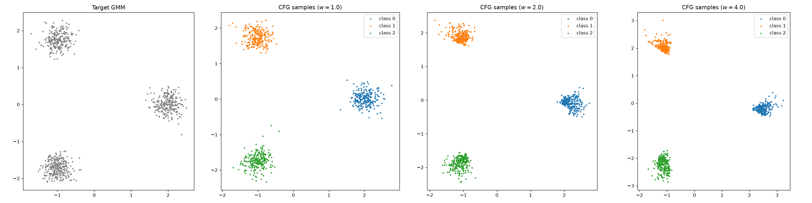
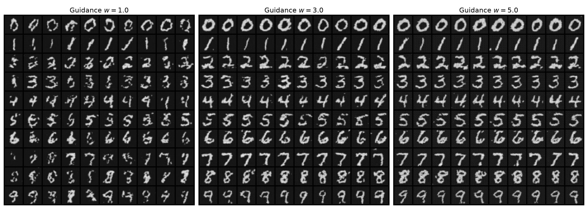

# Flow Matching & Diffusion — MIT 6.S184 / 6.S975 Labs

> Building generative models from a differential-equations viewpoint — an independent,
> from-skeleton implementation of **6.S184 / 6.S975 — Generative AI with Stochastic
> Differential Equations** (MIT), part of a [csdiy.wiki](https://csdiy.wiki/) full-catalog build.


## Overview

MIT's [6.S184](https://diffusion.csail.mit.edu/) teaches flow matching and diffusion by
*building* them: an ODE/SDE simulator, conditional probability paths, the flow- and
score-matching objectives, and finally a full conditional image generator with
classifier-free guidance, a diffusion transformer, and latent diffusion.

This repository implements **all three official labs** as a clean, importable Python
package (`flow_matching_labs/`) rather than notebook-only code, backed by a real pytest
suite and reproducible driver scripts. Every model is trained on the assignment's own
data (2-D toy distributions and MNIST) — CPU-scale, but real, with measured results and
generated samples saved under [`results/`](results/).

The base commit imports the official (unsolved) lab notebooks from
[`eje24/iap-diffusion-labs`](https://github.com/eje24/iap-diffusion-labs); every subsequent
commit implements the labs from scratch.

## Results (measured on CPU, 3 threads, `torch 2.12+cpu`)

### Lab 1 — ODE/SDE simulators (analytic checks)

| Quantity | Measured | Theory |
|---|---|---|
| Brownian motion Var$[X_5]$ ($\sigma=1$) | **4.86** | $\sigma^2 t = 5.0$ |
| OU stationary Var ($\theta{=}0.25,\sigma{=}0.5$) | **0.540** | $\sigma^2/2\theta = 0.5$ |
| OU stationary Var ($\theta{=}0.5,\sigma{=}1$) | **1.012** | $1.0$ |
| OU stationary Var ($\theta{=}1,\sigma{=}2$) | **2.028** | $2.0$ |
| Langevin mean log-density (before → after) | **−23.9 → −4.6** | rises toward the target |



*Langevin dynamics started from a broad Gaussian (left) collapses onto the modes of a
5-component Gaussian mixture (right) using only the density's score.*

### Lab 2 — flow matching & score matching (2-D density match)

| Experiment | Sampler | Energy distance to target |
|---|---|---|
| Gaussian path → symmetric GMM | learned ODE (flow matching) | **0.035** |
| Gaussian path → symmetric GMM | Langevin SDE (score matching) | **0.059** |
| Linear path → checkerboard | learned ODE (flow matching) | qualitative match (see figure) |





### Lab 3 — classifier-free guidance & image generation

**2-D sanity check (CFG on a 3-mode GMM).** Class-conditioned sample clouds land on
their modes; increasing the guidance scale $w$ trades diversity for sharper conditioning:

| Guidance $w$ | mean distance of conditioned cloud to its mode |
|---|---|
| 1.0 | **0.01 – 0.03** |
| 2.0 | 0.18 – 0.22 |
| 4.0 | 0.36 – 0.51 |



**MNIST digit generation (Diffusion Transformer + CFG).** A 0.78 M-parameter DiT trained
directly on MNIST pixels, sampled with classifier-free guidance:

<!-- MNIST_RESULTS -->
*(measured numbers filled in below by `scripts/run_lab3_mnist.py`.)*



*Rows are digit classes 0–9; columns are independent samples. Guidance strength increases
left → right across the three panels.*

## Implemented assignments

- [x] **Lab 1 — Simulating ODEs and SDEs**
  - Euler & Euler–Maruyama simulators; Brownian motion; Ornstein–Uhlenbeck process;
    Langevin dynamics; autodiff score of a `Density`.
- [x] **Lab 2 — Flow Matching and Score Matching**
  - `α_t`/`β_t` schedules; Gaussian conditional probability path (conditional vector field
    + score); flow-matching and denoising-score-matching trainers; recovering the marginal
    score from a learned flow; linear conditional path bridging arbitrary distributions.
- [x] **Lab 3 — A Conditional Generative Model for Images**
  - Classifier-free guidance (guided ODE + label-dropout trainer); Diffusion Transformer
    (Fourier time embedding, patchifier, multi-head attention with adaLN-zero, depatchifier);
    convolutional VAE (residual/attention/encoder/decoder blocks + ELBO); latent-diffusion
    trainer. Trained on MNIST.

## Project structure

```
flow-matching-6s184/
├── flow_matching_labs/      # the implementation (importable package)
│   ├── core.py              # ODE/SDE + Euler / Euler-Maruyama simulators
│   ├── distributions.py     # Gaussian, GMM, moons/circles/checkerboard, MNIST-shape sources
│   ├── lab1.py              # Brownian motion, OU process, Langevin SDE
│   ├── paths.py             # Gaussian & linear conditional probability paths + schedules
│   ├── models.py            # MLP vector-field / score nets + FM & SM trainers
│   ├── cfg.py               # classifier-free guidance ODE + trainer + base Trainer
│   ├── dit.py               # Diffusion Transformer
│   ├── vae.py               # variational auto-encoder
│   └── lab3.py              # MNIST sampler + pixel/latent CFG trainers + sampling
├── scripts/                 # reproducible drivers producing results/
├── tests/                   # 18 pytest checks (analytic + behavioural)
├── notebooks/               # official skeletons + executed *completed* notebooks
└── results/                 # measured metrics + figures + generated samples
```

## How to run

```bash
# Python repos use the shared csdiy env (Python 3.11, torch 2.12 CPU):
#   D:\Project\_csdiy\.venv-ml\Scripts\python.exe
python -m pip install -r requirements.txt   # or reuse the shared venv

# Verify the maths (fast, ~1 min):
python -m pytest tests/ -v

# Reproduce the figures / numbers:
python scripts/run_lab1.py         # Brownian / OU / Langevin        (seconds)
python scripts/run_lab2.py         # flow & score matching on 2-D    (~8 min CPU)
python scripts/run_lab3_toy.py     # CFG on a 3-mode GMM             (~2 min CPU)
python scripts/run_lab3_mnist.py   # train DiT + generate MNIST      (~1.5 h CPU)
```

The MNIST run is tunable via environment variables (`LAB3_STEPS`, `LAB3_DIM`,
`LAB3_LAYERS`, `LAB3_PATCH`, `LAB3_BATCH`, `LAB3_LR`) so it fits any compute budget.

## Verification

- **`pytest` (18 tests, all passing).** Lab 1: Euler integrates a constant ODE exactly,
  Brownian Var$=\sigma^2 t$, OU stationary Var$=\sigma^2/2\theta$, Langevin raises the
  target log-density, autodiff score matches the analytic Gaussian score. Lab 2: `α/β`
  endpoints & derivatives, the analytic conditional score, endpoint transport, the
  linear-path vector-field formula, and `ScoreFromVectorField`. Lab 3: Fourier/patchify/
  attention/DiT shapes, the VAE's `128×4×4` latent, CFG reducing to the conditional field
  at $w{=}1$, and CFG separating GMM modes after training.
- **Real training runs** produce the numbers and figures above; see `results/*/metrics.json`.
- **Executed notebooks** under `notebooks/*_completed.ipynb` carry their real outputs.

## Tech stack

Python 3.11, PyTorch 2.12 (CPU), einops, torchvision (MNIST), scikit-learn (toy 2-D data),
NumPy, matplotlib, pytest.

## Key ideas / what I learned

- An ODE/SDE **simulator** (Euler / Euler–Maruyama) is all you need to turn a learned drift
  into a sampler; Langevin dynamics samples *any* density from its score alone.
- A **conditional probability path** makes the intractable marginal flow/score learnable:
  you regress against the closed-form conditional vector field / score of $p_t(x\mid z)$.
- **Flow matching** (deterministic ODE) and **score matching** (Langevin SDE) are two views
  of the same Gaussian path; the marginal score can even be recovered analytically from a
  trained flow.
- **Linear paths** bridge *arbitrary* source and target distributions, not just Gaussian→data.
- **Classifier-free guidance** trains one network for both the conditional and unconditional
  fields (via label dropout) and interpolates between them at sampling time.
- A **Diffusion Transformer** with adaLN-zero conditioning and a **VAE** for latent diffusion
  scale the same recipe from 2-D toys to images.

## Credits & license

Based on the labs of **6.S184 / 6.S975 — Generative AI with Stochastic Differential
Equations** by Peter Holderrieth, Ezra Erives, and Ron Shprints (MIT, IAP 2026), with the
accompanying text *An Introduction to Flow Matching and Diffusion Models*. Official labs:
[diffusion.csail.mit.edu](https://diffusion.csail.mit.edu/) ·
[eje24/iap-diffusion-labs](https://github.com/eje24/iap-diffusion-labs). This repository is an
independent educational reimplementation; all course materials belong to their original
authors. Original code here is released under the [MIT License](LICENSE).
